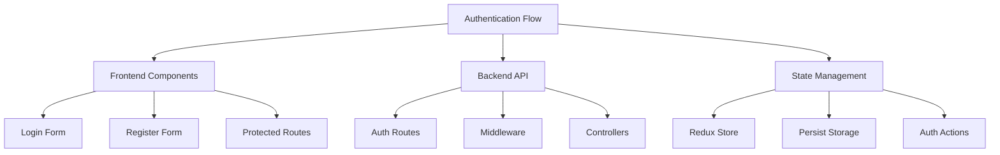
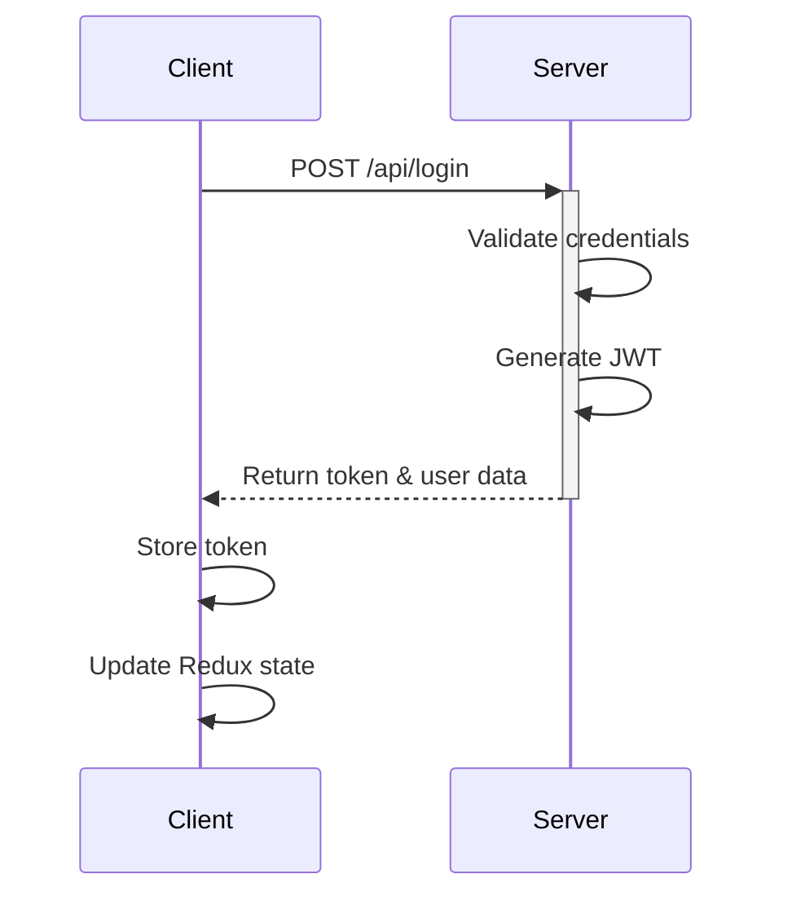

# Authentication Implementation Plan

## 1. Overview

Implementing a complete authentication system with proper login/register functionality and protected routes.

## 2. Architecture

### Authentication Flow



### Login Flow



## 3. Implementation Steps

### A. Backend Setup

- Create auth middleware for token verification
- Implement login/register endpoints
- Set up password hashing and JWT generation

### B. Frontend Enhancement

- Create axios instance with auth headers
- Implement token refresh mechanism
- Add logout functionality
- Enhance protected routes

### C. State Management

- Add token persistence
- Handle auth state rehydration
- Add authentication error handling
- Implement automatic token refresh

## 4. File Structure

```
src/
├── lib/
│   ├── api.ts (new - axios instance)
│   └── auth.ts (new - auth utilities)
├── middleware/
│   └── auth.ts (new - auth middleware)
├── components/
│   └── layout/
│       └── AuthLayout.tsx (new)
└── redux/
    └── slices/
        └── authSlice.ts (enhanced)
```

## 5. Security Considerations

- Token storage in secure httpOnly cookies
- CSRF protection
- Rate limiting for auth endpoints
- Password strength requirements
- Session management

## 6. Error Handling

- Token expiration
- Network errors
- Validation errors
- Server errors
