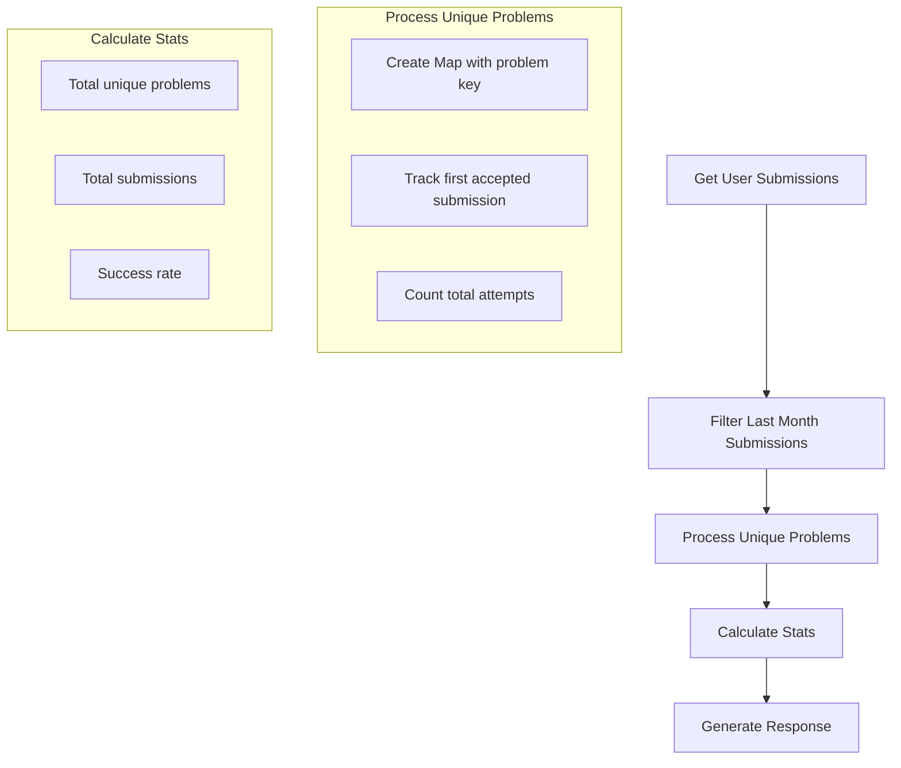

# Last Month Submissions Feature Implementation Plan

## Overview

Add functionality to track and analyze user submissions from the last month in the Codeforces API endpoint, focusing on unique problems while maintaining submission statistics.

## Data Structure

### LastMonthStats Interface

```typescript
interface LastMonthStats {
  // Overall statistics
  totalUniqueProblems: number;
  totalSubmissions: number;
  successRate: number;

  // Unique problems solved
  problems: Array<{
    contestId: number;
    index: string;
    name: string;
    attempts: number;
    acceptedTime: number; // Timestamp of first accepted submission
  }>;
}
```

### Enhanced Response Interface

```typescript
interface CodeforcesProblemResponse {
  success: boolean;
  data?: {
    handle: string;
    totalSolved: number;
    solvedProblems: Array<{
      contestId: number;
      index: string;
      name: string;
    }>;
    lastMonthActivity: LastMonthStats;
  };
  error?: string;
}
```

## Implementation Flow



## Processing Strategy

1. Filter Submissions

   - Get timestamp for 30 days ago
   - Filter submissions array for recent submissions

2. Track Unique Problems

   - Use Map with `${contestId}${index}` as key
   - Store problem details, submission count, and first accepted time
   - Update attempts count for each submission
   - Only store first successful submission time

3. Calculate Statistics
   - Count total unique problems
   - Sum all attempts
   - Calculate success rate
   - Format problem details for response

## Expected Response Example

```json
{
  "success": true,
  "data": {
    "handle": "user123",
    "totalSolved": 100,
    "solvedProblems": [...],
    "lastMonthActivity": {
      "totalUniqueProblems": 15,
      "totalSubmissions": 25,
      "successRate": 60,
      "problems": [
        {
          "contestId": 1700,
          "index": "A",
          "name": "Problem Name",
          "attempts": 3,
          "acceptedTime": 1683375000
        }
      ]
    }
  }
}
```

## Next Steps

1. Implement the enhanced interfaces
2. Add helper functions for submission processing
3. Integrate with existing caching mechanism
4. Add error handling for edge cases
