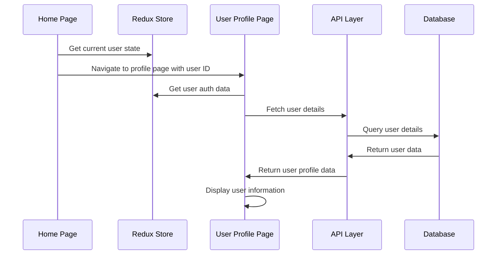

# User Profile Implementation Plan

## Overview

This document outlines the implementation plan for adding user profile functionality to the Codeforces Portal application.

## Flow Diagram



## Implementation Steps

### 1. Update Home Page (src/components/pages/home/index.tsx)

- Modify the Profile button to use React Router navigation
- Use the current user's ID from Redux store for navigation

### 2. Implement User Profile Page (src/components/pages/user/index.tsx)

- Create a new component to display user details
- Information to display:
  - Basic info (name, email, department)
  - Online judge handles:
    - VJudge
    - Codeforces
    - Clist
    - AtCoder
    - CodeChef
  - Account creation date
- Add loading and error states
- Style using Tailwind CSS to match app design

### 3. API Integration

- Create API endpoint for fetching user details
- Implement authorization using user token
- Handle error cases appropriately

### 4. Redux Integration

- Utilize existing auth slice for basic user data
- Implement proper error handling and loading states

## Technical Details

### Data Structure

User details are stored with the following schema:

```typescript
interface UserDetails {
  userId: string;
  name: string;
  department: string;
  semester: string;
  vjudge: string;
  codeforces: string;
  clist: string;
  atcoder: string;
  codechef: string;
  createdAt: Date;
}
```

### Authentication

- Uses JWT tokens for authentication
- Token stored in localStorage and Redux store
- Token included in API requests via Authorization header

## Implementation Considerations

1. Error Handling

   - Invalid/expired tokens
   - Network errors
   - Missing user data

2. Performance

   - Cache user profile data in Redux store
   - Show loading states during data fetch

3. Security
   - Validate user authentication
   - Protect API endpoints
   - Sanitize displayed data
